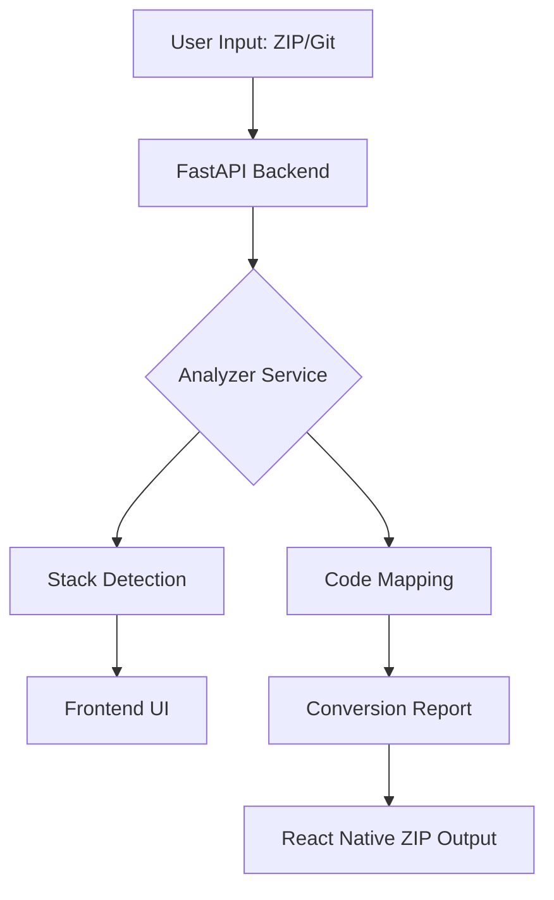

# 📱 WebToNative Converter

[](https://fastapi.tiangolo.com/)
[](https://reactjs.org/)
[](https://www.typescriptlang.org/)
[](https://vitejs.dev/)

**WebToNative** is an intelligent conversion engine designed to transform modern web applications into production-ready React Native starter structures. It analyzes your existing codebase, detects the technology stack, and generates a comprehensive migration report along with the initial mobile codebase.

---

## 🚀 Key Features

- **🔍 Smart Analysis**: Automatically detects frontend frameworks, backend APIs, databases, payment gateways, and styling solutions from ZIP uploads or Git URLs.
- **🛠️ Stack Overrides**: Review detected stacks and manually override them to ensure the conversion matches your target mobile architecture.
- **📊 Conversion Reports**: Detailed reports providing a conversion score, success rate, and specific lists of issues or warnings that need manual attention.
- **📦 Native Output**: Generates a downloadable React Native structure mapped from your web project's logic and components.
- **⚡ Real-time Feedback**: Live progress tracking for large repository analysis with ETA and step-by-step updates.

---

## 🛠️ Tech Stack

### Backend (The Engine)
- **FastAPI**: High-performance Python API framework.
- **Analysis Services**: Custom modules for code parsing and stack detection.
- **Storage**: Temporary job management for processing large repositories.

### Frontend (The Dashboard)
- **React & TypeScript**: Type-safe, component-driven user interface.
- **Vite**: Ultra-fast build tool and development server.
- **Modern CSS**: Premium, responsive UI with glassmorphism and dynamic animations.

---

## 📥 Installation

### Prerequisites
- Python 3.9+
- Node.js 18+
- Git

### Backend Setup
```bash
cd backend
python -m venv .venv
source .venv/bin/activate  # Windows: .venv\Scripts\activate
pip install -r requirements.txt
uvicorn app.main:app --reload
```

### Frontend Setup
```bash
cd frontend
npm install
npm run dev
```

---

## 📖 Usage

1. **Input**: Provide a ZIP file of your web project or a public Git URL.
2. **Analyze**: Click "Analyze" to start the codebase scanning process.
3. **Review**: Check the "Detected Stacks" section. Override any auto-detected items if necessary.
4. **Convert**: Click "Convert" to generate the React Native structure.
5. **Download**: Review the conversion report and download your new React Native starter.

---

## 🏗️ Architecture



---

## 🗺️ Roadmap

- [ ] Support for private Git repositories (SSH/Personal Access Tokens).
- [ ] AI-powered component mapping (Web DOM to Native Components).
- [ ] Direct export to Expo / React Native CLI.
- [ ] Cloud-based persistent dashboard for conversion history.

---

## 📄 License

This project is licensed under the MIT License. See the [LICENSE](LICENSE) file for details.

---

<p align="center">
  Built with ❤️ for developers who want to go mobile faster.
</p>
